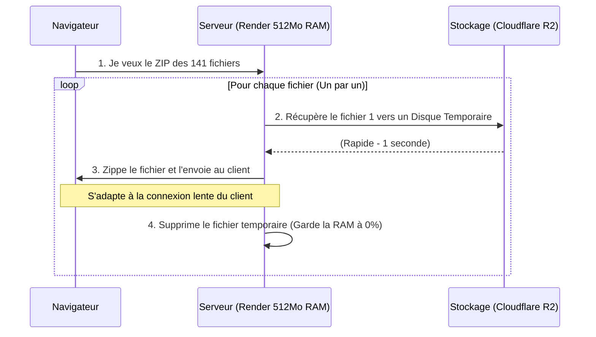

# Architecture Actuelle & Capacités du Système

Voici l'état exact de notre architecture FaaS Transfer aujourd'hui. Nous avons construit un système digne des applications professionnelles.

## Les Outils & Leurs Capacités

| Composant | Outil Utilisé | Rôle | Capacités & Limites |
| :--- | :--- | :--- | :--- |
| **Frontend** | React Native (Expo) | Interface Utilisateur (Web & Mobile) | Hébergé sur **Vercel** (très rapide). Sur mobile, tourne directement via le processeur du téléphone. Limite : la RAM du téléphone. |
| **Backend** | Node.js / Express | Chef d'orchestre (gère la sécurité et le ZIP) | Hébergé sur **Render** (Tier Gratuit). **Limites : 512 Mo de RAM**, 0.1 CPU, Timeout de 100 secondes. Idéal pour coordonner, mais faible pour du traitement lourd. |
| **Base de données** | Supabase (PostgreSQL) | Stocke l'historique, les profils et l'authentification | Hyper robuste. Gère des milliers de requêtes par seconde sans broncher. |
| **Stockage Fichiers** | Cloudflare R2 | Le "Disque Dur" où vont les vidéos et fichiers | **Capacité illimitée**. Fichier max par envoi : **5 Go**. Bande passante mondiale (CDN). Vitesse d'écriture/lecture fulgurante. |

---

## 1. Architecture d'Envoi (Upload) - *Pourquoi ça prend du temps ?*

> [!NOTE]
> L'upload se fait **directement** de ton téléphone vers Cloudflare R2. Le serveur Render n'est PAS utilisé pendant le transfert pour ne pas le surcharger.

```mermaid
sequenceDiagram
    participant Mobile as Téléphone
    participant Render as Serveur (Render)
    participant R2 as Stockage (Cloudflare R2)

    Mobile->>Render: 1. Demande d'autorisation (1 ms)
    Render-->>Mobile: 2. Ticket d'envoi accordé (1 ms)
    Note over Mobile,R2: 3. L'UPLOAD COMMENCE (C'est ici que ça prend du temps)
    Mobile=>>R2: 3. Envoi direct de la vidéo de 157 MB
    Note over Mobile,R2: La vitesse dépend UNIQUEMENT de ta box internet ou de ta 4G.
```

### Le mythe de la vitesse d'upload
Si ta vidéo de 157 Mo a pris du temps, **ce n'est pas un bug de l'application**. C'est une limite physique de ta connexion internet.
- En général, l'ADSL ou la 4G ont une vitesse de "Téléchargement" (Download) rapide, mais une vitesse d'"Envoi" (Upload) très lente (souvent bradée par les opérateurs).
- Si ton Upload est de 10 Mbps (mégabits par seconde) = environ **1.2 Mégaoctets par seconde**.
- Pour envoyer **157 Mo** à 1.2 Mo/s, il faut mathématiquement **~2 minutes et 10 secondes**. (Sur la fibre optique, ça prendrait 3 secondes).
- **Solution possible :** Afficher la vitesse en "Mo/s" sur la jauge de progression pour que l'utilisateur comprenne que l'application travaille à fond sur son réseau.

---

## 2. Architecture de Réception (Download)

Il y a deux chemins différents selon ce que le destinataire demande.

### Cas A : Fichier Unique
Le destinataire clique sur un fichier. Le téléchargement se fait **directement** depuis Cloudflare. Vitesse maximale, aucune limite de serveur.

```mermaid
sequenceDiagram
    participant Dest as Navigateur Destinataire
    participant Render as Serveur (Render)
    participant R2 as Stockage (Cloudflare R2)

    Dest->>Render: 1. Je veux la vidéo
    Render-->>Dest: 2. Voici le lien direct Cloudflare
    R2=>>Dest: 3. Téléchargement fulgurant (Download)
```

### Cas B : Le Bouton "Tout télécharger en .ZIP"
C'est ici que notre architecture complexe ("Buffer sur disque") intervient, pour contourner la faiblesse de notre serveur Render gratuit.



---
---

# Analyse des "Goulots d'étranglement" (Bottlenecks)

Pour comprendre où on peut gagner de la vitesse, il faut regarder exactement le trajet d'une vidéo de 157 Mo depuis ton téléphone jusqu'à la base de données.

## Le trajet exact de ta vidéo

```mermaid
gantt
    title Chronologie de l'envoi d'une vidéo (157 Mo)
    dateFormat  s
    axisFormat %S
    
    section 1. Préparation
    Clic "Envoyer" -> Render (Demande Ticket) : 1s, 0, 1s
    Render -> Cloudflare (Génère Lien) : 0.5s, 1s, 1.5s
    
    section 2. Upload Physique (Le Blocage)
    Envoi 157 Mo du Téléphone -> Antenne 4G/Wifi : active, 1.5s, 120s
    Antenne 4G -> Fibre Optique -> Cloudflare R2 : active, 1.5s, 120s
    
    section 3. Confirmation
    Cloudflare R2 -> Render (C'est bon) : 0.5s, 120s, 120.5s
```

Comme tu peux le voir sur le graphique ci-dessus, **99% du temps est passé dans la section jaune ("Upload Physique")**. 
Le blocage ne vient ni de notre code, ni de notre serveur Render, ni de Cloudflare. Le blocage est le câble (ou l'antenne 4G) qui relie ton téléphone à Internet. 

Cependant, en ingénierie, quand on ne peut pas changer les lois de la physique (la vitesse de ta box internet), on utilise des astuces logicielles.

---

## Les 3 Alternatives possibles pour "aller plus vite"

Voici les seules architectures existantes au monde pour contourner ce problème. À toi de me dire si l'une d'elles correspond à ta vision de FaaS Transfer.

### Alternative 1 : Le "Multipart Upload" (Envoi en parallèle)
Au lieu d'envoyer la vidéo de 157 Mo d'un seul coup, on coupe la vidéo en 30 morceaux de 5 Mo sur le téléphone. On envoie ensuite 4 morceaux *en même temps* sur 4 connexions TCP différentes.
- **Le Gain :** C'est la technique d'"Internet Download Manager". En multipliant les connexions, on force l'antenne 4G à nous donner plus de bande passante. On peut gagner 20% à 40% de vitesse.
- **Le Problème :** Couper un gros fichier en morceaux sur un téléphone (React Native) demande de charger les morceaux en RAM. C'est très complexe à coder sans faire crasher l'application (le fameux problème qu'on vient juste de corriger).

### Alternative 2 : La Compression Locale (Façon WhatsApp)
Quand tu envoies une vidéo de 157 Mo sur WhatsApp, elle s'envoie en 3 secondes. Pourquoi ? Parce que WhatsApp ne l'envoie pas ! Il lance un algorithme de compression sur ton téléphone, réduit la vidéo à 15 Mo avec une qualité dégueulasse, et envoie les 15 Mo.
- **Le Gain :** L'envoi est 10 fois plus rapide.
- **Le Problème :** FaaS Transfer est censé être un outil professionnel (comme WeTransfer) pour envoyer les *fichiers originaux*. Si un monteur vidéo envoie son travail, on ne peut pas réduire la qualité de sa vidéo. On pourrait proposer une case à cocher : *"Compresser pour envoyer plus vite"*.

### Alternative 3 : L'architecture Peer-to-Peer (WebRTC)
C'est la technologie utilisée par Apple AirDrop. Si l'expéditeur et le destinataire sont connectés en même temps, le fichier ne va plus sur Cloudflare. Il va DIRECTEMENT du téléphone A au téléphone B.
- **Le Gain :** Si les deux sont sur le même réseau Wifi, on atteint 50 Mo/s (le fichier de 157 Mo s'enverra en 3 secondes).
- **Le Problème :** Les deux personnes doivent avoir la page web ouverte en même temps. S'il n'y a pas de destinataire en ligne, ça ne marche pas.
